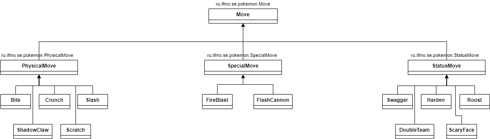
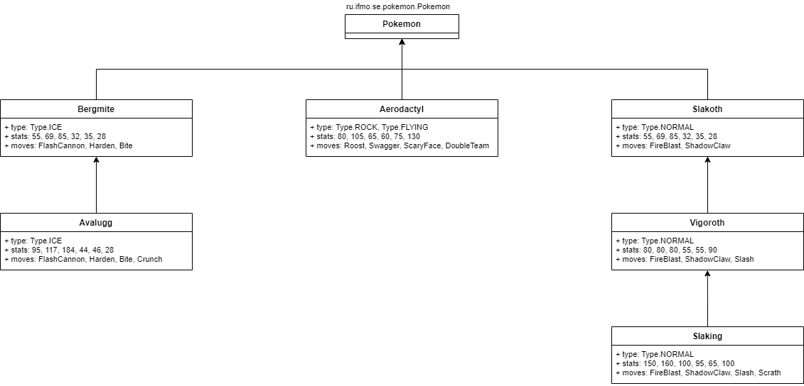

#### «Национальный исследовательский университет ИТМО»
### Программирование
## Лабораторная работа 2
## Вариант 367945
### Бутвин Михаил, P3130
###  2022
----

## Задание 

На основе базового класса Pokemon написать свои классы для заданных видов покемонов. Каждый вид покемона должен иметь один или два типа и стандартные базовые характеристики:

Классы покемонов должны наследоваться в соответствии с цепочкой эволюции покемонов. На основе базовых классов PhysicalMove, SpecialMove и StatusMove реализовать свои классы для заданных видов атак.

Атака должна иметь стандартные тип, силу (power) и точность (accuracy). Должны быть реализованы стандартные эффекты атаки. Назначить каждому виду покемонов атаки в соответствии с вариантом. Уровень покемона выбирается минимально необходимым для всех реализованных атак.

Используя класс симуляции боя Battle, создать 2 команды покемонов (каждый покемон должен иметь имя) и запустить бой.

## Код программы
https://github.com/mamsdeveloper/ProgrammingJava

## Результат выполнения

    Aerodactyl Yoko из команды красных вступает в бой!
    Slakoth Honoka из команды синих вступает в бой!
    Aerodactyl Yoko reduces opp`s SPEED.

    Slakoth Honoka hit with an intense flame. It may burn the target.
    Критический удар!
    Aerodactyl Yoko теряет 4 здоровья.

    Slakoth Honoka hit with an intense flame. It may burn the target.
    Критический удар!
    Aerodactyl Yoko теряет 4 здоровья.

    Aerodactyl Yoko restores HP by up to half of its max HP.

    Slakoth Honoka hit with an intense flame. It may burn the target.
    Критический удар!
    Aerodactyl Yoko теряет 5 здоровья.

    Aerodactyl Yoko restores HP by up to half of its max HP.

    Slakoth Honoka hit with an intense flame. It may burn the target.
    Критический удар!
    Aerodactyl Yoko теряет 4 здоровья.

    Aerodactyl Yoko causes confusion and raises ATTACK.

    Slakoth Honoka slashes with a sharp claw made from shadows.
    Критический удар!
    Aerodactyl Yoko теряет 7 здоровья.
    Slakoth Honoka slashes with a sharp claw made from shadows.
    Критический удар!
    Aerodactyl Yoko теряет 6 здоровья.

    Aerodactyl Yoko restores HP by up to half of its max HP.

    Aerodactyl Yoko теряет 4 здоровья.
    Slakoth Honoka slashes with a sharp claw made from shadows.
    Критический удар!
    Aerodactyl Yoko теряет 5 здоровья.
    Slakoth Honoka slashes with a sharp claw made from shadows.
    Критический удар!
    Aerodactyl Yoko теряет 8 здоровья.

    Aerodactyl Yoko reduces opp`s SPEED.

    Aerodactyl Yoko теряет 4 здоровья.
    Aerodactyl Yoko restores HP by up to half of its max HP.

    Slakoth Honoka растерянно попадает по себе.
    Slakoth Honoka теряет 4 здоровья.

    Aerodactyl Yoko теряет 4 здоровья.
    Aerodactyl Yoko теряет 25 здоровья.
    Avalugg Etsuko из команды красных вступает в бой!
    Avalugg Etsuko crunches with sharp fangs. May lower SP. DEF.
    Slakoth Honoka теряет 145 здоровья.
    Slakoth Honoka теряет сознание.
    Vigoroth Katsumi из команды синих вступает в бой!
    Vigoroth Katsumi slashes with a sharp claw made from shadows.
    Avalugg Etsuko теряет 6 здоровья.
    Vigoroth Katsumi slashes with a sharp claw made from shadows.
    Avalugg Etsuko теряет 4 здоровья.

    Avalugg Etsuko raises Defense by one stage.

    Vigoroth Katsumi slashes with claws.
    Avalugg Etsuko теряет 9 здоровья.
    Vigoroth Katsumi slashes with claws.
    Avalugg Etsuko теряет 9 здоровья.

    Avalugg Etsuko gathers all its light energy and releases it at once.
    Vigoroth Katsumi теряет 17 здоровья.

    Vigoroth Katsumi hit with an intense flame. It may burn the target.
    Avalugg Etsuko теряет 18 здоровья.

    Avalugg Etsuko bites with vicious fangs.
    Vigoroth Katsumi теряет 23 здоровья.

    Avalugg Etsuko raises Defense by one stage.

    Avalugg Etsuko gathers all its light energy and releases it at once.
    Vigoroth Katsumi теряет 13 здоровья.

    Avalugg Etsuko bites with vicious fangs.
    Vigoroth Katsumi теряет 16 здоровья.

    Avalugg Etsuko gathers all its light energy and releases it at once.
    Vigoroth Katsumi теряет 10 здоровья.
    Vigoroth Katsumi теряет сознание.
    Slaking Hiroaki из команды синих вступает в бой!
    Avalugg Etsuko raises Defense by one stage.

    Slaking Hiroaki slashes with a sharp claw made from shadows.
    Avalugg Etsuko теряет 3 здоровья.
    Slaking Hiroaki slashes with a sharp claw made from shadows.
    Avalugg Etsuko теряет 4 здоровья.

    Avalugg Etsuko bites with vicious fangs.
    Slaking Hiroaki теряет 137 здоровья.
    Slaking Hiroaki теряет сознание.
    В команде синих не осталось покемонов.
    Команда красных побеждает в этом бою!    

## Диаграмма созданной иерархии покемонов и атак

## Вывод
В ходе выполнения задания я познакомился ООП в java, научился использовать внешние jar-файлы в проекте